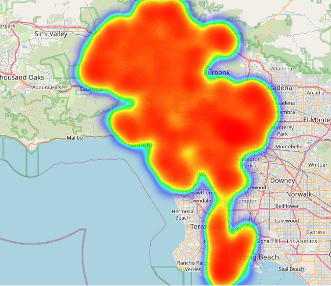

# Crime Data Heatmap Visualization

Visualizes crime data on an interactive heatmap using `folium` and displays it using `Datapane`. The heatmap is generated from a CSV file containing crime data with latitude and longitude information.

## Features
- Load crime data from a CSV file
- Generate a heatmap using `folium`
- Display the heatmap interactively with `Datapane`
- Option to save the heatmap as an HTML file for offline viewing

Data set (Crime Data from 2020 to Present: Crime_Data_from_2020_to_Present.csv):
1. 
2. 
3. 
